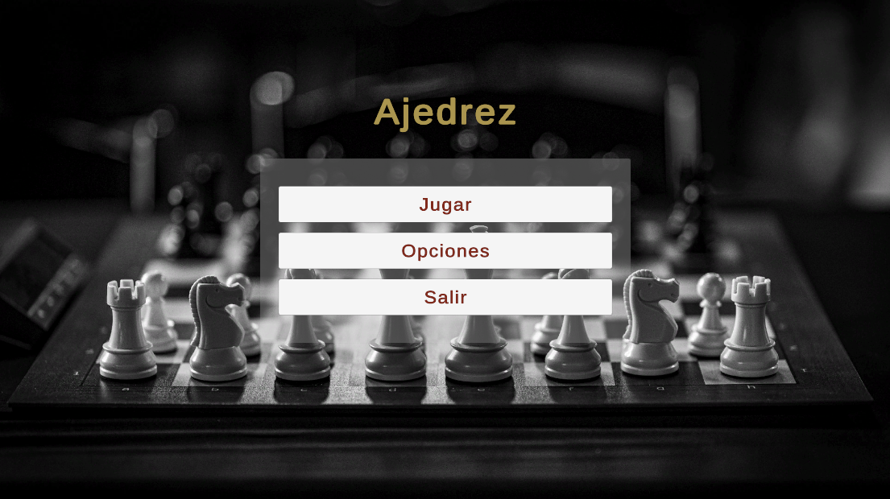
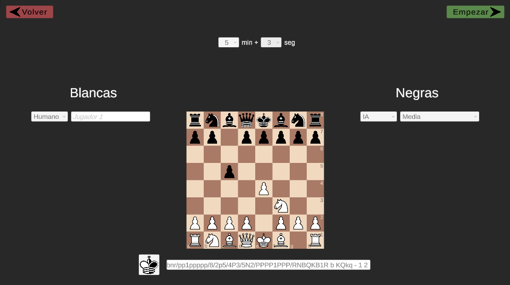
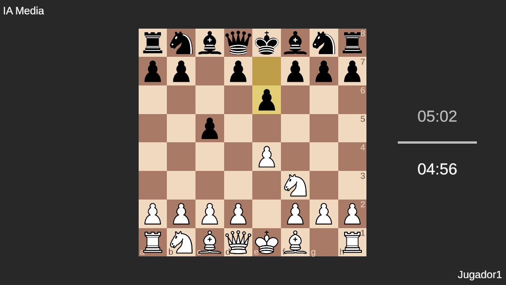
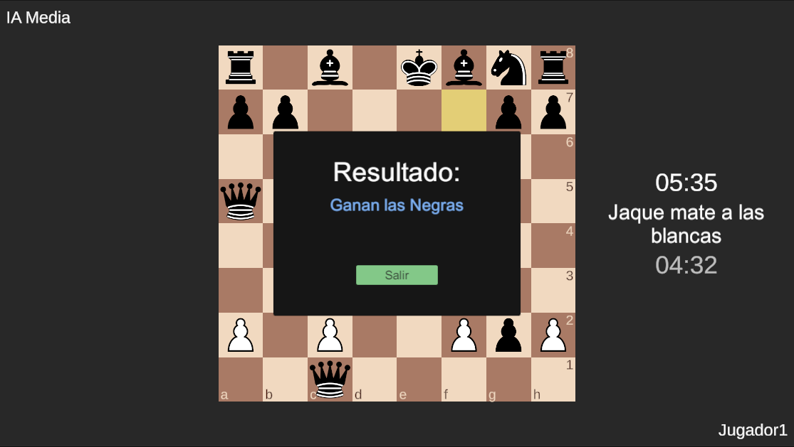
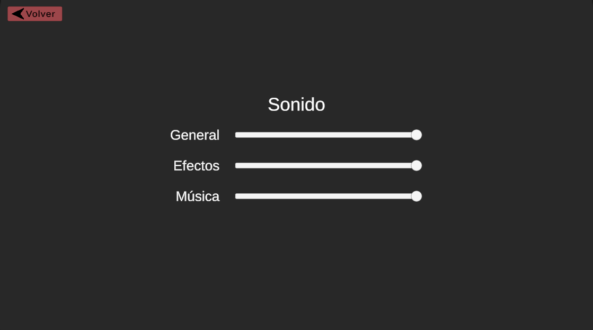

# Chess

This repository contains the code for my Bachelor’s Thesis in Computer Engineering, focused on developing a **chess artificial intelligence from scratch**. The project is a functional chess engine implemented within the **Unity** game development platform.

## Features

The core intelligence of the engine is separated into two main components: the search algorithm and the evaluation function.

### Search

This component is responsible for exploring potential moves and determining the best sequence of play.

* **Minimax Algorithm:** The AI uses the fundamental **Minimax search algorithm** to recursively explore the game tree.  This algorithm works by assuming the AI (the maximizing player) will always choose the move that leads to the highest possible score, while the opponent (the minimizing player) will choose the move that leads to the lowest score for the AI.
* **Alpha-Beta Pruning:** To make the search computationally feasible, the Minimax algorithm is significantly optimized using **Alpha-Beta Pruning**. This technique allows the engine to "prune" or cut off branches of the search tree that are guaranteed not to affect the final decision, drastically reducing the number of positions that need to be evaluated.
* **Legal Move Generation:** Robust logic is implemented to generate all valid moves for any given position, ensuring all special moves like castling, *en passant*, and pawn promotion are handled correctly before the search begins.

### Evaluation

The evaluation function provides a static score for any given board position, allowing the search algorithm to compare the terminal nodes of its search tree.

* **Classic Heuristic Function:** The position evaluation is performed using a **classic, hand-crafted heuristic function** designed to measure the relative advantage between the two sides.
* **Evaluation Criteria:** The function considers a weighted combination of standard chess criteria, including:
    * **Material Advantage:** Assigning numerical values to pieces (e.g., Pawn=1, Knight/Bishop=3, Rook=5, Queen=9).
    * **Positional Factors:** Using **piece-square tables** (PSTs) to assign bonus or penalty scores to pieces based on the squares they occupy (e.g., central squares for minor pieces, safe squares for the King).
    * **Pawn Structure and King Safety:** Incorporating terms that penalize weak pawn structures (e.g., isolated or doubled pawns) and reward secure King positions.

## Gallery

Main menu:

Game setup:

Gameplay:

Game result:

Settings:

## Inspiration

This project was inspired by tutorials and ideas from **Sebastian Lague**.